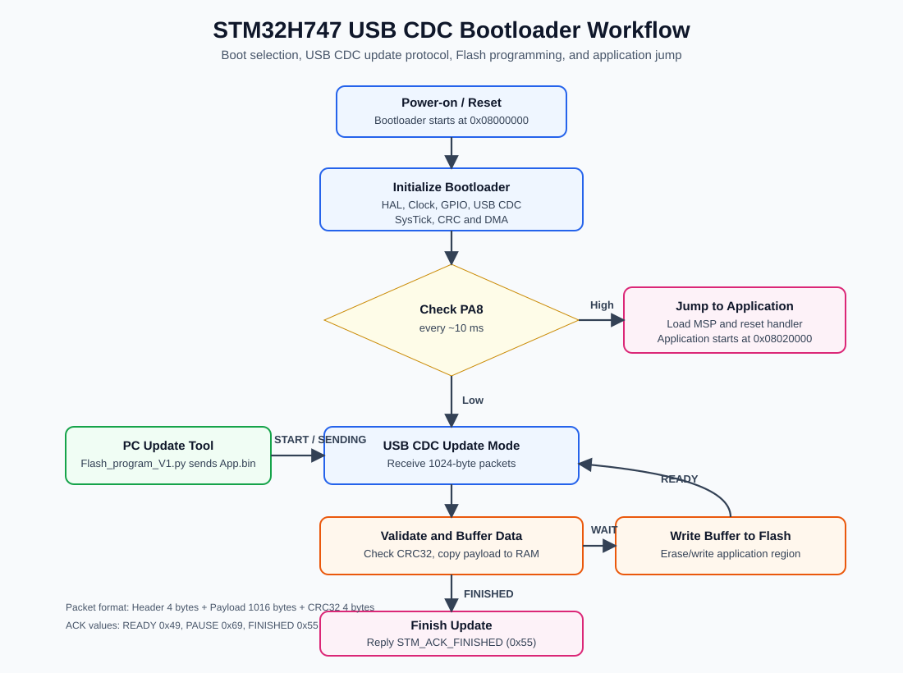

# STM32H747 USB CDC Bootloader

This project is an STM32H747 bootloader example that updates the application firmware through USB CDC. The repository contains two firmware targets:

- Bootloader: runs first after reset and manages firmware updates.
- Application: user firmware stored after the bootloader flash region.

The bootloader receives `App.bin` from a PC tool, validates incoming packets with CRC32, buffers firmware data in RAM, writes it to internal Flash, and can jump to the application at `0x08020000`.

## Workflow



## Runtime Behavior

After reset, the bootloader initializes HAL, the system clock, GPIO, USB CDC, SysTick, and CRC/DMA. It then checks input pin `PA8` approximately every 10 ms.

- If `PA8` is High, the bootloader jumps to the application address `0x08020000`.
- If `PA8` is Low, the bootloader stays in USB CDC update mode and waits for commands from the PC.

During firmware update mode, the PC sends `App.bin` in fixed-size 1024-byte packets. The STM32 checks packet CRC, stores valid firmware data into a RAM buffer, writes the buffer to Flash when needed, and sends ACK packets back to the PC.

## Repository Layout

```text
.
+-- App/                 Main source files for Bootloader and Application
|   +-- Inc/
|   +-- Src/
+-- BPS/                 Board / Bootloader Platform Support
|   +-- Inc/
|   +-- Src/
+-- Flash_program/       Python PC-side firmware update tool
+-- MDKApp/              Keil uVision project for the Application
+-- MDKBootloder/        Keil uVision project for the Bootloader
+-- libraries/           STM32 HAL, LL, CMSIS, and USB Device libraries
+-- Datasheet/           Reference documents
+-- schemetic/           Hardware schematic and board reference files
+-- setup program/       Supporting setup files and tools
```

## Memory Layout

| Region | Start address | Size | Description |
|---|---:|---:|---|
| Bootloader | `0x08000000` | `0x00020000` | Bootloader flash region |
| Application | `0x08020000` | `0x000E0000` | Application firmware region updated through USB CDC |

The application start address is defined in `BPS/Inc/Bootloader.h`:

```c
#define FLASH_START_APP1 0x08020000
```

The Keil scatter files also define the same memory regions:

- `MDKBootloder/Objects/Bootloader.sct`
- `MDKApp/Objects/App.sct`

## Key Source Files

| File | Purpose |
|---|---|
| `App/Src/main_Bootloader.c` | Bootloader entry point. Initializes the system, checks `PA8`, and either jumps to the application or processes USB CDC commands. |
| `App/Src/main_App.c` | Example application entry point. Initializes clock/GPIO and toggles GPIO outputs. |
| `BPS/Src/Bootloader.c` | Handles application jump, Flash unlock/lock, sector erase, Flash write, and bootloader command processing. |
| `BPS/Src/USB_CDC.c` | Handles USB CDC callbacks, packet receive/transmit, CRC checking, and firmware buffer loading. |
| `BPS/Src/Clock_system.c` | Configures system clock, SysTick, and GPIO. |
| `Flash_program/Flash_program_V1.py` | PC-side Python GUI tool for selecting a COM port, choosing a `.bin` file, and sending firmware to the bootloader over USB CDC. |

## USB CDC Packet Format

Each firmware update packet is `1024 bytes`.

| Field | Size | Description |
|---|---:|---|
| Header | 4 bytes | Command 1 byte, firmware version 1 byte, packet size 2 bytes |
| Payload | 1016 bytes | Firmware data |
| CRC | 4 bytes | CRC32 of header + payload |

## USB CDC Commands

| Command | Value | Direction | Meaning |
|---|---:|---|---|
| `PC_CMD_START` | `0x07` | PC -> STM32 | Start update process and erase the application Flash area |
| `PC_CMD_SENDING` | `0x67` | PC -> STM32 | Send one firmware data packet |
| `PC_CMD_WAIT` | `0x20` | PC -> STM32 | Ask STM32 to write the RAM buffer to Flash |
| `PC_CMD_FINISHED` | `0x99` | PC -> STM32 | Tell STM32 that all firmware packets have been sent |
| `STM_ACK_READY` | `0x49` | STM32 -> PC | STM32 is ready for the next packet |
| `STM_ACK_PAUSE` | `0x69` | STM32 -> PC | STM32 buffer is full; PC should pause and send `PC_CMD_WAIT` |
| `STM_ACK_FINISHED` | `0x55` | STM32 -> PC | Firmware update completed successfully |

## Firmware Update Steps

1. Build the application project from `MDKApp/App.uvprojx` and generate `App.bin`.
2. Put the board into bootloader update mode by holding `PA8` Low.
3. Run the Python GUI update tool.

```powershell
cd Flash_program
python Flash_program_V1.py
```

4. Select the STM32 USB CDC COM port from the `COM Port` drop-down. Click `Refresh` if the board was connected after the tool was opened.
5. Click `Browse` and select the application firmware `.bin` file. If `Flash_program/App.bin` exists, it is selected by default.
6. Click `Start Flash` and watch the status text, progress bar, and log output.

When the update succeeds, STM32 replies with `STM_ACK_FINISHED (0x55)`, and the new firmware is stored in the application Flash region.

The `Reset` button clears the GUI status and refreshes the COM port list. If a firmware update is running, `Reset` requests the current operation to stop.

## Build Projects

Open the Keil uVision projects directly:

- Bootloader: `MDKBootloder/Bootloader.uvprojx`
- Application: `MDKApp/App.uvprojx`

Flash the bootloader first. Then build the application as `App.bin` and update it through the USB CDC firmware update tool.

## Jump to Application

The bootloader reads the initial stack pointer and reset handler from the application start address:

```c
vJumpToApp = (pFunction)(*(__IO uint32_t*)(FLASH_START_APP1 + 4));
__set_MSP(*(__IO uint32_t*)FLASH_START_APP1);
```

Because of this, the application must be linked to start at `0x08020000`. If the application is linked to a different address, the bootloader will jump to the wrong vector table.

## Notes

- The folder name `MDKBootloder` is kept as it exists in the project.
- `Flash_program/Flash_program_V1.py` uses `tkinter` for the GUI and `pyserial` to communicate over the USB CDC serial port.
- If `pyserial` is not installed, install it with `pip install pyserial`.
- `FIRMWARE_VERSION` can be changed in `Flash_program/Flash_program_V1.py` if the firmware protocol version changes.
- The bootloader erases the application Flash area when `PC_CMD_START` is received, so verify the selected `.bin` file and COM port before starting an update.
